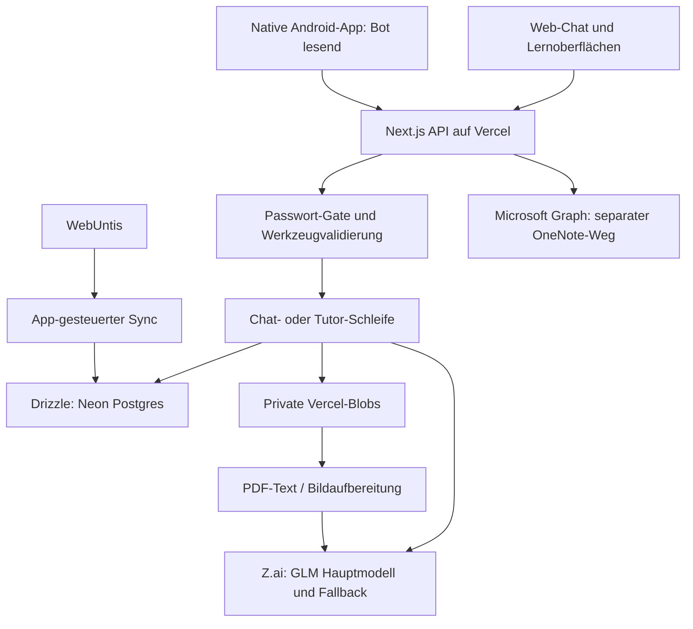

# Atlas AI: Fähigkeiten, Oberfläche und Infrastruktur

## Reparaturstand nach der Analyse

**Vorgabe: Atlas bleibt dauerhaft eine private Ein-Personen-App. Mehrbenutzerfähigkeit ist kein Ziel und keine zu behebende Lücke.**

Am 7. September 2026 mit drei Subagenten repariert, lokal noch nicht veröffentlicht:

- Datenfehler werden als unbekannt gekennzeichnet; keine falsche Schulfrei-Aussage, Kürzungen werden benannt.
- Streamfehler, unvollständige Tool-Aufrufe, Rundenlimit und Abbruch werden korrekt behandelt; Generatoren übernehmen das Abbruchsignal.
- Begrüßung erzeugt keine leeren Gespräche mehr; Verlaufabfragen sind gebündelt, Modellkontext begrenzt, Base64-Bilder werden nicht mehr protokolliert.
- Notenvorschläge werden anhand ihrer Nachrichten-ID atomar bestätigt oder verworfen. Wiederholte und parallele Bestätigungen erzeugen keine Doppelnoten. Alte unklare Vorschläge mit bereits passender Note verlangen einen manuellen Abgleich.
- Cache, neuer Chat, Scrollposition, Fokus, zugängliche Eingabe, Touch-Ziele und kurze mobile Fenster repariert; Hinweise zu Teilergebnissen sichtbar.
- Tutor-Ergebnisse, Planpunkte und Fachzuordnung validiert; Kartenübernahme atomar, gemeinsames Zeitbudget statt mehrfacher Einzelbudgets.
- Android-Vertrag für den Verlauf einschließlich Unit- und Instrumentation-Test-Fixtures korrigiert.

Prüfung: **836 Tests in 74 Testdateien bestanden**, einschließlich echter Transaktions-/Konkurrenztests in einer eigens angelegten lokalen Testdatenbank. Typecheck und Produktionsbuild bestanden. Isolierte Browser-Regressionen sowie zwei Android-Vertragstests und die Kotlin-Kompilierung der Instrumentation-Tests bestanden. Reale synthetische Modellprobe mit repariertem Parser: korrekte Werkzeugauswahl, etwa 5,7 Sekunden. Keine neuen Tabellen und keine Migration für diese Reparatur erforderlich.

Grenzen bleiben: Bereits an die Datenbank übergebene Schreibvorgänge können beim Stoppen noch abgeschlossen werden. Die Bildverarbeitung ist weiterhin nicht zuverlässig live bestätigt. Neue Fähigkeiten wie OCR, Sprachmodus, native Android-Chats oder Hintergrundjobs wurden nicht ergänzt. Der folgende Abschnitt dokumentiert die ursprüngliche Diagnose vor der Reparatur; nicht jeder dort aufgeführte Ausbauwunsch ist für den privaten Einsatz nötig.

---

Stand: 7. September 2026. Lokaler Code am Ende der Prüfung: `3d66f7e`.

Atlas besitzt eine umfangreiche, sinnvoll in den Schulalltag integrierte KI-Funktionalität. Die entscheidende Lücke ist die fehlende Durchgängigkeit: allgemeiner Chat, Tutor, Lernplanung, Dateiverarbeitung und Android verwenden unterschiedliche Fähigkeiten und Zustandsmodelle. Die nächste Entwicklungsrunde sollte diese Übergänge und die Verlässlichkeit absichern.

## Prüfgrundlage

- Quellcode von Web-Chat, Werkzeugen, Modelladapter, Tutor, Generatoren, Lernplanung, Android-Bot, Datenbankzugriff, Authentifizierung, Upload und Migrationen gelesen.
- Aktuelle Web-Komponenten mit Original-CSS in isolierter Browser-Vorschau geprüft: Desktop, 390 × 844 und 390 × 470 Pixel. Daten und Modellstream waren simuliert; Next-Link/Navigation wurden für die Vorschau adaptiert, Schrift als Arial-Fallback. Das belegt Komponentenlayout und Interaktionen, nicht die vollständige Next.js-App oder echtes Smartphone-Tastaturverhalten.
- Live-Seite bis zum Passwort-Gate geöffnet; kein authentifizierter visueller Durchgang durch Production erfolgt. Alte Screenshots vom 3. September wurden als historische Referenz erkannt und nicht als aktueller UI-Nachweis verwendet.
- Vercel-Projekt, Deployment-Metadaten, Buildfehler und ein begrenztes Runtime-Logfenster live gelesen.
- Reale Modellprobe mit synthetischer Frage und einem rein beschriebenen, nicht ausgeführten Werkzeug durchgeführt.
- Die Ergebnisse aus dem ersten Analysedurchgang gelten weiter: 110 Bot-Tests bestanden, Typecheck bestanden; Gesamtlauf 726 Tests bestanden, 51 übersprungen, acht Testdateien durch nicht erreichbare Neon-Datenbank fehlgeschlagen. Kein weiterer Gesamtlauf mit schreibenden Datenbanktests wurde angestoßen.
- Keine Änderungen am Produktcode, kein eigener Deploy und keine Änderungen an Schulunterlagen. Die lokale UI-Prüfung hatte keine Verbindung zu Datenbank oder KI.

## 1. Das tatsächliche Können

### Drei getrennte KI-Bereiche

| Bereich | Umsetzung | Bedeutung |
|---|---|---|
| Allgemeiner Assistent | `/api/bot`, `lib/bot`, `BotChat` | Fragen zum Schulalltag und begrenzte Datenänderungen |
| Tutor | `/api/lernen/tutor`, `lib/tutor`, `LernenTutor` | Interaktive Lern- und Probesitzungen mit eigener Historie |
| Generatoren und Diagnose | `lernen-generieren.ts`, `lernplan-generieren.ts` | Karten, Lernzettel, Varianten, Antwortbewertung und Prüfungsplanung |

Alle verwenden dieselbe Modellanbindung. Sie teilen weder eine vollständige gemeinsame Gesprächshistorie noch einen einheitlichen Satz an Werkzeugen. Der allgemeine Chat liest Lernstände, aber keine Tutor-Transkripte. Eine Aussage wie „Erinnerst du dich an meinen Fehler von gestern im Tutor?“ ist deshalb nicht zuverlässig aus den Tutor-Gesprächen beantwortbar.

### Die 18 Chat-Werkzeuge

| Werkzeug | Tatsächliche Reichweite | Grenze |
|---|---|---|
| `stundenplan_lesen` | Unterricht im angefragten Zeitraum, Raum, Lehrkraft, Status und Vertretungstext | Liest den Datenbankspiegel, fragt Untis nicht selbst frisch ab |
| `jetzt_lesen` | Aktuelle Stunde, nächste Stunde und zugehöriger Kontext | Versteht App-Daten; sieht weder Bildschirm noch reale Unterrichtssituation |
| `aufgaben_lesen` | Aufgaben nach Fach, offen/erledigt und Typ | Größere Ergebnismengen ohne eigenes Kontextbudget |
| `faecher_lesen` | Aktive Fächer mit Stammdaten | Keine neuen Fächer anlegen |
| `notizen_lesen` | Fach- und Stundennotizen, optionale Textsuche | Einfache Teilstringsuche; kein semantischer Suchindex |
| `noten_lesen` | Noten und berechnete Übersichten | Aussagen bleiben an hinterlegte Noten und Gewichtungen gebunden |
| `lehrplan_lesen` | Hinterlegter Lehrplan mit Quellenangabe | Kein Wissen darüber, was die Lehrkraft tatsächlich als Nächstes behandelt |
| `dateien_auflisten` | Metadaten hinterlegter Fachdateien | Kein Webzugriff und kein Zugriff auf beliebige lokale Dateien |
| `datei_lesen` | Text/PDF-Extraktion und Bildaufbereitung | Textkürzung; kein OCR-Fallback für gescannte PDFs |
| `aufgabe_anlegen` | Titel, Fach, Typ, Fälligkeit, Notiz | Kein Schutz gegen doppelte logische Aufträge |
| `aufgabe_aendern` | Titel, Notiz, Fälligkeit, erledigt/offen | Fach und Aufgabentyp lassen sich mit diesem Werkzeug nicht ändern |
| `notiz_anlegen` | Fachnotiz erstellen | Kein OneNote-Export über das Chat-Werkzeug |
| `notiz_aendern` | Titel oder vollständigen Text ersetzen | Kein Diff, keine Vorversion, kein echtes Undo für Änderungen |
| `note_vorschlagen` | Notenvorschlag als Karte | Speicherung erfordert Klick; Vorschlagsentscheidung nicht persistent |
| `lernstand_lesen` | Fällige Karten, Fortschritt, Themen, Prüfungen; optional bis zu 30 Karten | Kein vollständiges pädagogisches Langzeitgedächtnis |
| `lernplan_lesen` | Plan, Sicherheit, heutige und überfällige Einheiten | Keine Erstellung oder Neuverteilung durch den Chat |
| `lernkarten_erzeugen` | Material eines Fachs, Quelle und Thema, gewünschte Anzahl 1–30 | Keine konkreten Datei-/Notiz-IDs im Chat-Schema; Bilder werden im Generator übersprungen |
| `lernkarte_anlegen` | Einzelne Frage-Antwort-Karte | Inhalt wird nicht unabhängig fachlich geprüft |

Quelle: [tools.ts](/Users/thimofejzapko/Desktop/schule/lib/bot/tools.ts).

### Der Tutor ist didaktisch deutlich spezieller

Der Tutor fragt den Wissensstand ab, stellt Auswahlfragen über Widgets, erstellt Checklisten mit fünf bis acht Aufgaben, bewertet Antworten und liefert ein Fazit mit Schwächen und neuen Kartenvorschlägen. Die Modi Lernen und Probe haben verschiedene Prompts; eine Prüfungssimulation kann mehrere Lernplanpunkte behandeln.

Sein Kontext umfasst Fach, Lernart, Thema, Lernzettel, Karten und Prüfungsnähe. Schwache Karten werden bevorzugt. Grenzen: maximal 40 Kontextkarten, 6.000 Zeichen Lernzettel und 15.000 Zeichen zugeordnete Arbeitsblätter. Bilddateien werden bei den Tutor-Arbeitsblättern nicht verarbeitet. Bei einer gesamten Prüfungssimulation gelangen zunächst Punkttitel, IDs und Sicherheit ins Modell; daraus entsteht nicht automatisch ein vollständiger materialgestützter Prüfungskontext.

Die didaktischen Regeln sind gute Vorgaben, aber überwiegend Promptregeln: „erst Hint, dann Lösung“, „keine langen Textwände“ oder „keine Hinweise in der Probe“ sind nicht vollständig als Zustandsautomat erzwungen.

**Reproduzierter Befund:** `parseFazit({punkte:100, gesamt:1, punktePlan:[{pointId:"synthetisch", prozent:500}]})` liefert `ok: true`. Die Session kann daraus unplausible Prozentwerte und Noten ableiten. Nötig sind endliche Zahlen, `0 <= punkte <= gesamt`, ein positives Gesamtbudget, Prozentwerte zwischen 0 und 100 und ein Abgleich der gemeldeten Punkte mit der tatsächlichen Checkliste bzw. dem Plan.

Quellen: [Tutor-Prompt](/Users/thimofejzapko/Desktop/schule/lib/tutor/prompt.ts), [Ergebnisparser](/Users/thimofejzapko/Desktop/schule/lib/tutor/tools.ts:246), [Ergebnisberechnung](/Users/thimofejzapko/Desktop/schule/lib/tutor/session.ts:414).

### Lernen ist eine Mischung aus KI und festen Regeln

- Vier Lernarten: Aufgaben, Vokabeln, Wissen und Texte. Drei Kartenarten: Wissen, Vokabel und Aufgabe.
- Generatoren erstellen Karten, Lernzettel, Erklärungen und Varianten. Eine KI kann freie Antworten bewerten.
- Leitner-Wiederholung verwendet Boxen und feste Abstände von 0, 1, 3, 7, 14 und 30 Tagen.
- „Sicherheit“ ist ein aus Kartenboxen bzw. Tutor-Ergebnissen abgeleiteter Wert. Sie ist keine kalibrierte Wahrscheinlichkeit, eine Klassenarbeit zu bestehen.
- KI extrahiert Lernplanpunkte und Diagnoseinhalte; die Verteilung auf Tage erfolgt durch deterministischen Anwendungscode mit Zeitbudgets und Phasen.

Diese Trennung ist sinnvoll: Termin- und Budgetarithmetik muss nicht vom Modell geraten werden. In der Oberfläche sollte erkennbar sein, ob ein Wert aus Selbsteinschätzung, Karten oder einer Probe stammt.

### Dateiverständnis ist uneinheitlich

Der allgemeine Reader erkennt Text, Markdown, CSV, PDFs und Bilder. Der normale Upload erlaubt jedoch PDF, PNG, JPEG, WebP und HEIC, mit 10 MiB pro Datei und bis zu zehn Dateien pro Upload. Reader-Fähigkeiten und tatsächlich erreichbarer Uploadpfad sind damit nicht identisch.

PDFs werden als Text extrahiert, auf 20.000 Zeichen begrenzt und ohne gesicherte Seitenbelege weitergegeben. Ein Scan ohne Textschicht erhält keinen OCR-Ersatz. Tabellen und Formeln werden nicht als strukturierte Fachobjekte geprüft.

Der Kartengenerator liest ohne explizite Auswahl nur die ersten fünf Dateien. Er überspringt Bilder, setzt Notizen vor Dateien und Lehrplan und schneidet den Gesamtkontext bei 30.000 Zeichen ab. Bei vielen Notizen kann der relevante Dateiteil vollständig aus dem Kontext fallen. Diese Grenze wird nicht als vollständiges Quellenprotokoll dargestellt.

Generierte Karten enthalten in diesem Bot-Pfad keine genaue Zuordnung zur Quellseite oder Textstelle. „Nur aus Material“ ist eine Promptvorgabe, kein Beweis für die Richtigkeit jeder Karte.

Quellen: [Dateireader](/Users/thimofejzapko/Desktop/schule/lib/bot/files.ts), [Uploadgrenzen](/Users/thimofejzapko/Desktop/schule/lib/file-limits.ts), [Generator-Kontext](/Users/thimofejzapko/Desktop/schule/lib/lernen-generieren.ts:69).

### Was der Chat derzeit nicht integriert kann

Keine Websuche, keine Sprachaufnahme/-ausgabe, kein direkter Chat-Dateiupload, keine Bildschirmwahrnehmung, kein dauerhafter Hintergrundauftrag, keine Push-Erinnerung, kein OneNote-Exportwerkzeug und kein vollständiger Lernplan-Erstellungsablauf im Chat. Teile davon existieren an anderer Stelle der App, sind aber keine Chat-Fähigkeit.

Ein besonders wertvoller Übergang wäre: „Hilf mir für die Mathearbeit“ → passende Prüfung identifizieren → vorhandenes Material prüfen → Lernplan anbieten → direkt den passenden Tutor mit Kontext öffnen. Heute sind mehrere dieser Schritte auf verschiedene Oberflächen verteilt.

## 2. Oberfläche und Interaktion

### Urteil

Die visuelle Basis ist konsistent und zurückhaltend. Für eine belastbare Freigabe müssen Interaktions- und Zugänglichkeitsprobleme behoben werden. Ein kompletter visueller Production-Abnahmetest steht aus.

Positiv: klare Trennung von Nutzerfrage und Antwort, deutsche Beschriftungen, kontextbezogene Startvorschläge, sichtbare Aktionskarten, kompakter Composer, 16-Pixel-Eingabetext, Fokusmarkierungen und Unterstützung reduzierter Bewegung. Die Vollseite nutzt eine lesbare, begrenzte Textbreite. Das nichtmodale Panel ermöglicht, im Stundenplan weiterzuarbeiten.

### Konkrete UI-Befunde

| Priorität | Befund und Beleg | Verbesserung |
|---|---|---|
| Hoch | Während jedes Stream-Updates springt der Chat ohne Rücksicht auf die Leseposition ans Ende. Im Code hängt `scrollTo` direkt an `turns`. | Nur automatisch folgen, wenn der Nutzer bereits nahe am Ende ist; sonst „Neue Antwort“ anbieten. |
| Mittel | Das Chatfeld erscheint im Accessibility-Baum ohne Namen; nur der Placeholder ist gesetzt. | Dauerhafte zugängliche Beschriftung, z. B. `aria-label="Nachricht an Atlas"`. |
| Mittel | Senden/Stop messen 36 × 36 px. Eintragen/Verwerfen sind 28 px hoch, mit je 4 px Pseudo-Fläche insgesamt 36 px. | Auf 44 px praktische Touch-Fläche vergrößern. Das ist die verwendete Touch-Qualitätsvorgabe, keine pauschale Behauptung, jede kleinere Fläche verletze WCAG. |
| Mittel | Nach Schließen des Panels und Ende der Animation landet der Fokus in der Testvorschau auf `BODY`. | Fokus an den Auslöser zurückgeben. Ein Fokusfang ist bei bewusst nichtmodalem Panel nicht erforderlich. |
| Mittel | Für die eigentliche Antwort gibt es keinen benannten Chat-Log bzw. kontrollierten Live-Bereich. Die gefundenen Live-Regionen gehören zu Toasts. | Fertige Antworten und Fehler geordnet ansagen, ohne jeden Token oder Modellgedanken vorzulesen. |
| Mittel | Bei 390 × 470 px schrumpft das schwebende Panel auf etwa 262 px Höhe. Die Startvorschläge passen nicht vollständig in den sichtbaren Bereich. | Bei geringer Höhe bzw. mobil einen größeren Sheet-/Vollseitenmodus vorsehen. Die Prüfung ersetzt keinen Test mit echter Bildschirmtastatur. |
| Mittel | Der Verlauf ist vor allem ein Archiv: kein „Hier weiterschreiben“, keine Suche und keine Pagination für ältere Gespräche. | Gespräch direkt fortsetzen und weitere Einträge laden können. |
| Mittel | Fehler bieten wenig Wiederaufnahme: keine Retry-Aktion, kein klarer Status „teilweise abgeschlossen“. | Fehlgeschlagen, abgebrochen, abgeschlossen und teilweise ausgeführt unterscheiden; sicheren Wiederholungsweg anbieten. |
| Mittel | Die Lernkartenkarte ignoriert `hinweis`; selbst null erzeugte Karten können als erfolgreiche Aktion samt „Erledigt“ erscheinen. | Hinweise und Teilerfolg direkt in der Karte anzeigen. |
| Mittel | Aufgaben-/Notizkarten zeigen weder vollständige Vorher-Nachher-Änderung noch durchgehend einen direkten Öffnen-Link. | Änderung nachvollziehbar machen und das Ergebnis mit einem Klick öffnen. |

Quellen: [Scrollverhalten](/Users/thimofejzapko/Desktop/schule/components/bot-chat.tsx:366), [Eingabe](/Users/thimofejzapko/Desktop/schule/components/bot-chat.tsx:704), [Aktionskarten](/Users/thimofejzapko/Desktop/schule/components/bot-action-card.tsx), [Overlay](/Users/thimofejzapko/Desktop/schule/components/bot-launcher.tsx).

Der sichtbare Modellgedankengang ersetzt keine überprüfbare Fortschrittsanzeige. Für den Alltag wären „Stundenplan gelesen“, „zwei Dateien geprüft“ und „eine Aufgabe gespeichert“ hilfreicher. Der generierte Gedankentext kann vorläufig sein und ist kein Nachweis, dass eine Aktion tatsächlich ausgeführt wurde.

### Mobile und Android sind getrennt zu bewerten

Der Web-Chat ist responsive. Die native Android-App implementiert dagegen keinen Sendepfad für Chatnachrichten. Ihr Bildschirm verweist für neue Gespräche auf den Browser und zeigt Vorschläge als Text.

Zusätzlich besteht ein klarer API-Vertragsfehler: Android erwartet im Detail `{id,title,turns}`, die Web-API liefert `{conversation,messages}`. Bei `ignoreUnknownKeys=true` und den vorhandenen Standardwerten kann die Detailansicht still leer werden. Auch `hasCreated` wird von Android erwartet, vom aktuellen Listenendpunkt aber nicht berechnet geliefert.

Quellen: [Android-Bot](/Users/thimofejzapko/Desktop/schule/android/app/src/main/java/dev/atlas/schule/ui/BotBildschirm.kt), [Android-DTO](/Users/thimofejzapko/Desktop/schule/android/app/src/main/java/dev/atlas/schule/data/Dto.kt:504), [Web-Verlaufs-API](/Users/thimofejzapko/Desktop/schule/app/api/bot/verlauf/[id]/route.ts).

## 3. Infrastruktur und Datenfluss

### Live bestätigter Betriebsstand

- Projekt `atlas`, GitHub-Anbindung `Thimorrow/atlas`, Vercel-Team auf Hobby, Node `24.x`.
- Das geprüfte funktionierende Production-Deployment ist `dpl_E7s8LBHnHEz3YdfL4zMkR3URSL7s`, Commit `69788e6`, Zustand `READY`, Region `iad1`. Es trug bei der Prüfung den Alias `atlas-ten-orpin.vercel.app`.
- Ein späterer Production-Build zu `2ac8fe9` scheiterte am 7. September um 21:21 Uhr deutscher Zeit in `npm install` mit `E401`.
- Der separat bereits gestartete Fix auf `codex/fix/vercel-optional-lapse`, Commit `3d66f7e`, wurde während dieser Analyse als Preview `READY`. Das ist kein Nachweis, dass er bereits Production ersetzt hat.
- Die Suche nach Bot-Runtime-Logs der letzten 24 Stunden lieferte keine Treffer. Ein allgemeines Ein-Stunden-Fenster enthielt erfolgreiche Requests, Redirects und einen 404. Daraus folgt weder eine gemessene Bot-Erfolgsrate noch Fehlerfreiheit.

Belege: [Production-Deployment](https://vercel.com/zapkothimofej-2616s-projects/atlas/E7s8LBHnHEz3YdfL4zMkR3URSL7s), [fehlgeschlagener Build](https://vercel.com/zapkothimofej-2616s-projects/atlas/57mqkxnRaG1V7wu5mM8UEHxvdwTw), [Fix-Preview](https://vercel.com/zapkothimofej-2616s-projects/atlas/8RXhQZejwcaCv7ACD5sWNdruxjhL).

### Modellbetrieb

Konfiguriert sind `glm-5.3` und `glm-5.3-flash` am Z.ai-Endpunkt. Beide Modelle liegen beim selben Anbieter; der Fallback hilft daher nicht automatisch bei einem gemeinsamen Anbieter- oder Netzwerkproblem.

Reale synthetische Probe: „Welche Aufgaben habe ich in Mathematik?“ mit einem rein lesenden Werkzeug. Das Hauptmodell antwortete mit HTTP 200 und wählte korrekt `aufgaben_lesen({fach:"Mathematik"})`. Dauer etwa 4,6 Sekunden. Kein Werkzeug wurde ausgeführt. Das ist ein einzelner Nachweis für Konnektivität und Tool-Auswahl, kein Benchmark und kein Nachweis fachlicher Antwortqualität.

Eine zweite reale Probe schickte ein künstliches rotes PNG über genau den Bildadapter der App. Der Anbieter antwortete nach etwa 3,2 Sekunden mit HTTP 200; der Durchlauf war nach dem gesetzten 55-Sekunden-Gesamtlimit noch nicht abgeschlossen und wurde abgebrochen. Die Probe belegt weder zuverlässiges Bildverständnis noch grundsätzliche Inkompatibilität. Insbesondere ist HTTP 200 hier kein Nachweis einer erfolgreichen Bildanalyse.

Pro Modellaufruf sind 8.192 Ausgabetokens konfiguriert, pro Chat-Anfrage sechs Runden. Das erlaubt rechnerisch bis zu 49.152 Ausgabetokens über diese Runden; verschachtelte Kartengenerierung kommt hinzu. Das ist ein technisches Maximum, keine Verbrauchs- oder Kostenmessung. Historie und Werkzeugergebnisse werden wiederholt als Eingabe gesendet. Usage-Ereignisse werden nicht als Verbrauchsmetriken persistiert.

Der Adapter hat 30 Sekunden Idle-Timeout. Das ist keine Gesamtdauer: Ein regelmäßig Daten liefernder Stream kann länger laufen. Der Tutor hat zusätzlich 110 Sekunden pro Runde, seine Route aber 120 Sekunden maximale Gesamtlaufzeit. Mehrere langsame Runden passen nicht in dieses Budget. Die allgemeine Bot-Route setzt kein eigenes `maxDuration`; ihre effektive Plattformgrenze wurde nicht separat erhoben.

Quelle: [Modelladapter](/Users/thimofejzapko/Desktop/schule/lib/bot/model.ts), [Tutor-Route](/Users/thimofejzapko/Desktop/schule/app/api/lernen/tutor/[id]/route.ts:14).

### Datenbank und Konsistenz

Neon wird für einfache Abfragen über HTTP angesprochen. Für mehrteilige Schreibvorgänge existiert inzwischen ein separater Postgres-Pool mit Transaktionshilfe. Die Lernplan-Erstellung nutzt diesen Weg. Ältere Projektnotizen, die pauschal fehlende Transaktionen behaupten, sind damit überholt.

Der Chat selbst speichert eine Werkzeugwirkung und anschließend das Gesprächsprotokoll getrennt. Scheitert das Protokollieren nach einer erfolgreichen Änderung, kann die Änderung bestehen bleiben, während der Nutzer nur einen Fehler sieht. Ein wiederholter Auftrag kann duplizieren. Es fehlen eine dauerhafte Ausführungs-ID, eine Sperre pro Gespräch und ein eindeutiger Status pro Nutzerzug.

Beim Tutor gibt es für das Übernehmen vorgeschlagener Karten bereits eine gespeicherte `kartenAngelegt`-Markierung. Der Ablauf „lesen → Karten anlegen → markieren“ ist jedoch nicht atomar; parallele Requests können beide die Vorprüfung passieren.

Quellen: [Datenbank](/Users/thimofejzapko/Desktop/schule/lib/db/index.ts), [Chat-Ausführung](/Users/thimofejzapko/Desktop/schule/app/api/bot/route.ts:168), [Tutor-Kartenübernahme](/Users/thimofejzapko/Desktop/schule/app/api/lernen/tutor/[id]/karten/route.ts).

### Historie und Skalierung

`GET /api/bot` legt bereits beim Begrüßungsabruf ein Gespräch an. Die Verlaufsliste lädt daraufhin bis zu 100 Gespräche und ihre gesamten Nachrichten über einzelne Abfragen, filtert leere Gespräche erst danach und gibt maximal 20 zurück. Häufiges Öffnen erzeugt deshalb unnötige Daten; viele leere Einträge können echte ältere Gespräche aus dem Suchfenster verdrängen.

Bilder werden als Base64 auch in Werkzeugergebnissen gespeichert. Der allgemeine Verlauf wächst weiter, nur alte Tool-Ergebnisse werden aus dem Modellkontext entfernt. Für mehrere Schuljahre entstehen dadurch unnötige Daten-, Kontext- und Übertragungskosten.

Einfacher Zielzustand: Gespräch erst bei der ersten Nachricht anlegen; Liste nur mit Titel, Datum und aggregiertem Aktionsstatus laden; Nachrichten paginieren; Datei-IDs statt Bildkopien speichern; Modellkontext mit Gesamtbudget und Zusammenfassung begrenzen.

### Datenfrische und Autonomie

Untis wird durch App-Aktivität synchronisiert, hauptsächlich auf der Planseite. Die Policy sieht morgens kurze Intervalle vor, tagsüber bis zu sechs Stunden Alter und nachts zwölf Stunden. Der Bot löst keinen eigenen Abgleich aus und bekommt keinen verbindlichen Frischezustand im Prompt.

Der Datenbankspiegel verarbeitet empfangene Stunden mit Upserts. Eine zuvor gespeicherte Stunde, die später vollständig aus der Quelle verschwindet, wird dadurch nicht automatisch entfernt. Ein explizit empfangener Ausfallstatus wird aktualisiert; das Fehlen einer Zeile ist ein anderer Fall. Diese Differenz braucht einen gezielten Sync-Test und eine fachliche Lösch-/Entfallregel.

Es gibt keinen dauerhaft laufenden Bot-Worker. Die Karten-Queue ist eine begrenzt parallele Client-Queue, keine beständige Hintergrundinfrastruktur. Browser schließen bedeutet deshalb keinen verlässlich weiterarbeitenden Assistenten.

Quellen: [Sync-Policy](/Users/thimofejzapko/Desktop/schule/lib/untis/sync-policy.ts), [Upserts](/Users/thimofejzapko/Desktop/schule/lib/untis/sync.ts:12), [Client-Queue](/Users/thimofejzapko/Desktop/schule/lib/lernplan-karten-queue.ts).

### Sicherheit und Datenschutz im konkreten System

Das Passwort-Gate mit HMAC-Cookie, HttpOnly, SameSite=Lax und Secure in Production ist eine bewusst einfache Ein-Personen-Lösung. Ohne Passwortvariable bleibt die App offen. Produktionskonfiguration sollte deshalb fehlende Pflichtwerte ablehnen. Das Cookie gilt ein Jahr; Logout entfernt es im Browser, widerruft aber keine bereits kopierte gültige Sitzung. Das Login-Limit liegt nur im Prozessspeicher und ist kein instanzübergreifendes Kontingent.

Bot und Tutor haben keinen eigenen serverseitigen Mengen-/Kostenbegrenzer. Die allgemeine Chatnachricht besitzt keine Längenobergrenze; der Tutor begrenzt normale Freitextnachrichten dagegen auf 4.000 Zeichen. Mehrbenutzerfähigkeit ist nicht vorhanden: Gespräche und Schuldatensätze sind nicht nach Nutzerkonten getrennt.

Private Blobs schützen den direkten Speicherzugriff. Sobald Atlas ihre Inhalte zur KI schickt, erhält Z.ai die verarbeiteten Inhalte. Das ist eine andere Grenze als der Blob-Zugriff. Anbieteraufbewahrung, Vertragsbedingungen und regionale Datenverarbeitung wurden nicht geprüft. Die Vercel-Funktionsregion `iad1` allein beantwortet nicht, wo sämtliche beteiligten Dienste Daten verarbeiten.

Notiztitel und andere Nutzdaten stehen teilweise direkt im Systemkontext. Quellen müssen als Daten klar abgegrenzt werden. Vor allem schreibende Werkzeuge benötigen technische Zustimmungs- und Auftragsgrenzen; eine Promptregel allein ist keine Ausführungsberechtigung.

### Betrieb und Migrationen

Der Build führt vor `next build` einen eigenen Migrator aus. Er liest alle Migrationen bei jedem Lauf erneut und ignoriert ausgewählte „existiert bereits“-Fehler. Ein persistentes Ausführungsjournal bzw. Checksummentracking verwendet dieser Pfad nicht. Fehlende SQL-Dateien werden still übersprungen. Änderungen an Daten werden wiederholt ausgeführt, sofern ihre SQL-Bedingung sie nicht selbst begrenzt.

Das ist bei ausschließlich sorgfältig idempotentem SQL handhabbar, aber kein belastbarer Ersatz für genau einmal ausgeführte Migrationen. Zusätzlich existiert `/api/admin/migrate` hinter demselben normalen App-Gate. Preview-/Production-Datenbanktrennung, Backup-Aufbewahrung und ein getesteter Restore wurden nicht live verifiziert und bleiben offen.

Für den Bot fehlen strukturierte Messwerte pro Anfrage: Modell, erster Token, Gesamtdauer, Werkzeugzeiten, Ergebnisstatus, Fallbackgrund und Tokenverbrauch. Viele Modellfehler erscheinen im NDJSON bei HTTP 200. Reines HTTP-Statusmonitoring übersieht diese Fehler.

Quelle: [Migrationen](/Users/thimofejzapko/Desktop/schule/scripts/migrate.mjs:44), [Admin-Endpunkt](/Users/thimofejzapko/Desktop/schule/app/api/admin/migrate/route.ts).

## 4. Bereits belegte Zuverlässigkeitsprobleme aus der ersten Analyse

1. Datenfehler werden im Lagebild zu „keine Schule“ bzw. „keine Aufgaben“ statt „nicht verfügbar“.
2. Bestätigte und verworfene Notenvorschläge werden nach Wiederherstellung erneut als offen angezeigt.
3. SSE-Fehlerereignisse und EOF ohne Abschluss werden als Erfolg behandelt; mit synthetischen Streams reproduziert.
4. Cache-Auffrischung scheitert an Array-Referenzvergleich; im Cache-Zweig fehlt der Abbruch beim Unmount.
5. Stop wird nicht vor jedem Werkzeug geprüft und erreicht verschachtelte Generatoren nicht zuverlässig.
6. Erfolgreiche Bot-Aktionen invalidieren betroffene UI-Caches nicht durchgängig.
7. Bei Erreichen des Rundenlimits fehlt ein ausdrücklicher unvollständiger Abschluss.
8. Notizänderungen besitzen keine Vorversion, und Bildkontext wird in späteren Gesprächsrunden nicht korrekt als Bild rekonstruiert.

## 5. Priorisierte Weiterentwicklung

### Zuerst: Vertrauen und Datenkonsistenz

- Datenverfügbarkeit und Frische explizit machen, keine falschen Leeraussagen.
- Stream-Ende, Timeout, Abbruch, Teilerfolg und Rundenlimit korrekt unterscheiden.
- Notenvorschläge dauerhaft und idempotent bestätigen.
- Werkzeugausführung mit Auftrags-ID, Gesprächssperre und überprüfbarem Ergebnisstatus versehen.
- Tutor-Ergebnisse gegen Punktebudget, Wertebereiche und Planpunkte validieren.
- Android-Vertragsabweichung korrigieren.

### Danach: Die vorhandenen Fähigkeiten besser erreichbar machen

- Chat → Prüfung → Lernplan → Tutor als zusammenhängenden Übergang anbieten.
- Dateiauswahl mit nachvollziehbaren Quellen und sichtbaren Verarbeitungsgrenzen.
- Angelegte Objekte direkt öffnen, geänderte Inhalte vergleichen und wiederherstellen.
- Mobile Darstellung, Scroll-Folgen, Fokus und zugängliche Beschriftungen korrigieren.
- Historische Gespräche fortsetzen, suchen und paginieren.

### Anschließend: Betrieb messbar machen

- Strukturierte, datensparsame KI-Metriken und ein Verbrauchsbudget.
- Eindeutige Trennung von Preview, Production und Integrations-Testdatenbank.
- Migrationen mit Ausführungsjournal; Backup und Restore praktisch überprüfen.
- Persistente Hintergrundjobs nur dann ergänzen, wenn Atlas tatsächlich bei geschlossener App weiterarbeiten oder erinnern soll.

### Akzeptanzfälle für die nächste Runde

| Szenario | Erfolgskriterium |
|---|---|
| Stundenplan nicht erreichbar | Keine Behauptung, dass heute schulfrei sei |
| Aktuelle Vertretung | Antwort nennt Datenstand und korrekten Status |
| Notenvorschlag bestätigen, reloaden, erneut klicken | Genau eine Note, korrekter dauerhafter Vorschlagsstatus |
| Zwei parallele Nachrichten im selben Chat | Geordnete Historie, keine doppelten Aktionen |
| Stop während Kartengenerierung | Keine weiteren geplanten Schreibaktionen; bereits Gespeichertes sichtbar |
| SSE-Fehler und fehlender Abschluss | Ehrlicher Fehler-/Teilstatus, sichere Wiederaufnahme |
| Gescanntes PDF und Bild | Tatsächliche Unterstützung oder konkrete Einschränkung statt scheinbarer Verarbeitung |
| Viele Notizen und eine relevante Datei | Relevante Quelle ausgewählt; Kürzungen sichtbar |
| Falsche Tutor-Punkte oder fremde Plan-ID | Ergebnis serverseitig abgelehnt |
| Im Stream nach oben scrollen | Leseposition bleibt erhalten |
| Keyboard und Screenreader | Benannte Eingabe, verlässliche Fokusführung und Antwortansage |
| Android-Verlauf | API-Fixture wird in echte Fragen und Antworten umgesetzt |

Das Produkt hat genügend Funktionen für einen nützlichen persönlichen Schulassistenten. Sein größter nächster Wertgewinn entsteht durch konsistente Übergänge, überprüfbare Ergebnisse und verlässliches Verhalten unter Fehlern.
